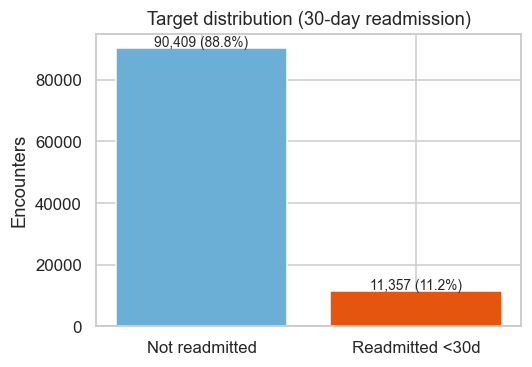
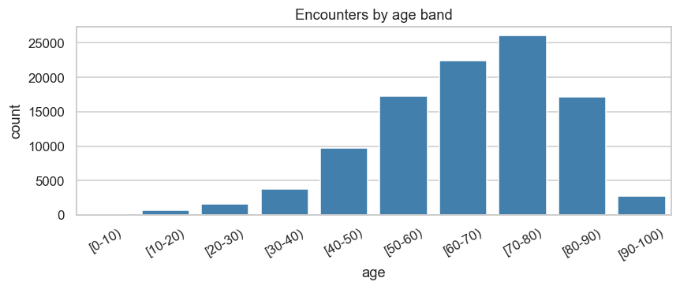
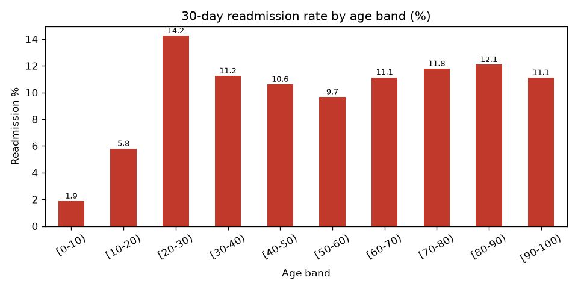
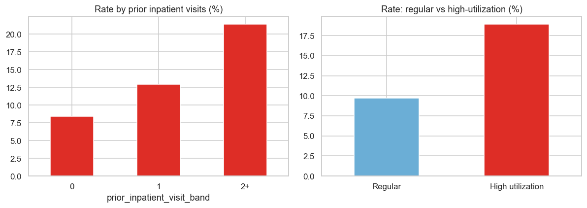
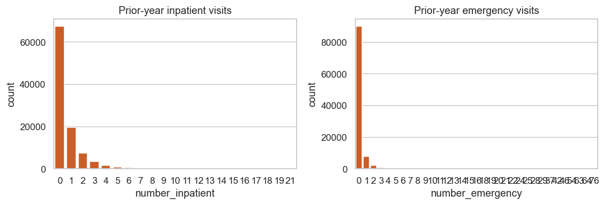
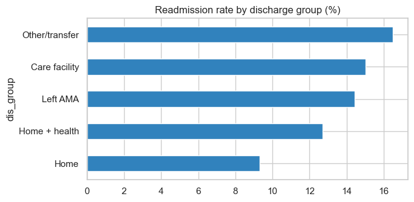
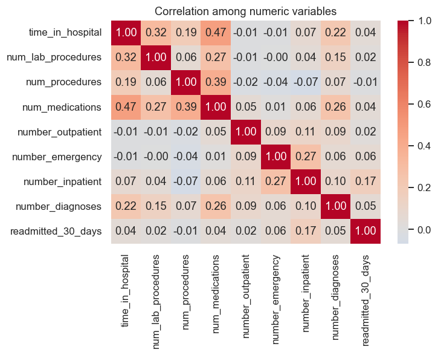
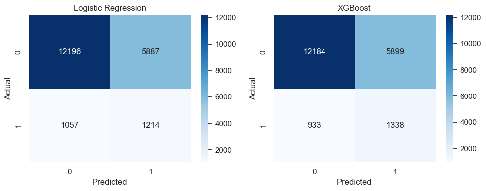
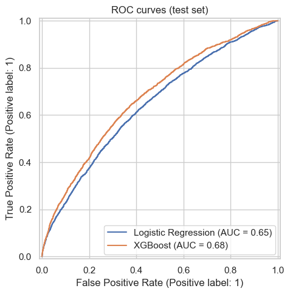
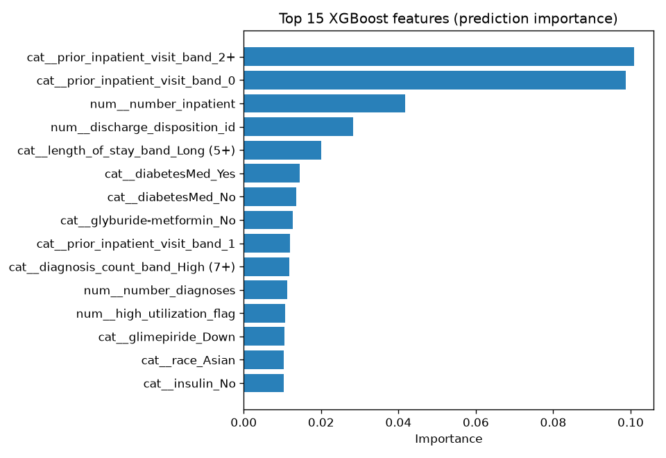

# Healthcare Patient Readmission Analytics


Which hospital encounters come back within 30 days — and what relates to it?
An interview-friendly, end-to-end analysis of **101,766 hospital encounters**
(diabetes patients, 130 US hospitals, 1999–2008): SQL analytics, Python EDA,
hypothesis testing, and two explainable classifiers.

> Historical encounters only — this is **not** a clinical decision-making system
> and it gives no medical advice.

## Table of contents

- [Business problem](#business-problem)
- [Dataset](#dataset)
- [Results at a glance](#results-at-a-glance)
- [Key findings (with charts)](#key-findings-with-charts)
- [Methods](#methods)
  - [Data cleaning](#1-data-cleaning)
  - [SQL analysis](#2-sql-analysis)
  - [Exploratory analysis](#3-exploratory-analysis)
  - [Statistical testing](#4-statistical-testing)
  - [Machine learning](#5-machine-learning)
- [Potential business actions](#potential-business-actions)
- [Limitations](#limitations)
- [How to run](#how-to-run)
- [Project structure](#project-structure)
- [Future improvements](#future-improvements)
- [Author](#author)

## Business problem

Hospitals track **30-day readmissions** as a quality and cost signal: every return
stay consumes beds, staff time, and budget. This project answers three practical
questions on historical data:

1. **Which patient cohorts** are historically readmitted most often?
2. **How does prior hospital use** relate to the chance of returning?
3. **Can a simple model** flag high-return patterns for further analytical review?

## Dataset

UCI Diabetes 130-US Hospitals for Years 1999–2008
([link](https://archive.ics.uci.edu/dataset/296/diabetes+130+us+hospitals+for+years+1999+2008),
CC BY 4.0 — cited in README of the raw data).

- Raw file: `data/raw/diabetic_data.csv` — **101,766 encounters × 50 columns**
- `data/raw/IDS_mapping.csv` — codebooks for admission type / discharge / admission source
- One row = one hospital encounter (71,518 unique patients; some patients appear multiple times)
- Target: `readmitted_30_days` — `"<30"` → 1, `">30"` / `"NO"` → 0

| Target value | Encounters | Share |
|---|---|---|
| Not readmitted (0) | 90,409 | 88.84% |
| Readmitted <30d (1) | 11,357 | **11.16%** |



The target is **imbalanced** — a model that always predicts "not readmitted" scores
89% accuracy while finding zero readmissions. Every evaluation below therefore uses
precision, recall, F1, and ROC-AUC alongside accuracy.

## Results at a glance

| Metric | Value |
|---|---|
| Overall 30-day readmission rate | **11.16%** |
| Highest-risk simple rule (2+ prior inpatient stays) | **21.40%** |
| High-utilization cohort (15.7% of encounters) | **18.93%** |
| Share of all readmissions from ages 60–90 | **~67%** |
| Best model (XGBoost, test set) | Recall **0.59**, ROC-AUC **0.68** |
| SQL business questions answered | **25** |

## Key findings (with charts)

**1. Encounters concentrate in older adults — and older bands return most.**
Most stays involve ages 50–90. Among large cohorts, the 70–90 bands combine the
highest rates with the largest volume. (The small [20–30) band spikes at 14.2%
but holds only 1,657 encounters — a reminder to check denominators before reacting.)




**2. Past hospital use is the strongest return signal in the data.**
Patients with 2+ inpatient stays in the prior year return at **21.4%**, vs **8.4%**
with none. The engineered `high_utilization_flag` (3+ total prior-year visits)
splits the population into 9.7% vs 18.9% — nearly double.




**3. Where patients go after discharge relates to returns.**
Facility/transfer discharges sit at ~15–16% vs ~9% for routine home discharge.
Discharge planning is worth reviewing (association, not proof of cause).



**4. Everything else points the same way.**
Longer stays, more diagnoses, and heavier medication loads all align with higher
return rates — while no single numeric variable correlates strongly with the target
(all |r| < 0.2), which is exactly why a multivariate model is used.



**5. The model agrees with the descriptive analysis.**
XGBoost's most important predictors are prior-inpatient bands, inpatient-visit
counts, discharge disposition, diagnosis load, and stay length — the same variables
that stood out in SQL and EDA. See [Machine learning](#5-machine-learning).

## Methods

### 1. Data cleaning

Script: `src/data_cleaning.py` → `data/processed/diabetes_clean.csv` (101,766 × 39).
Features: `src/feature_engineering.py`. Every decision is printed as a report when
the script runs.

| Step | Decision |
|---|---|
| `"?"` values | Treated as missing (the dataset's missing marker) |
| Columns dropped (17) | `weight`, `payer_code`, `medical_specialty` (>30% missing); `encounter_id` (pure row id); 13 medication columns that are >99.5% one value (no signal) |
| Gaps filled | `race`, `diag_1/2/3` → `"Missing"` category; `Unknown/Invalid` gender → `"Unknown"` |
| Kept deliberately | `A1Cresult` / `max_glu_serum` = `"None"` means *test not done* — a real care signal, not missing |
| Duplicates | 0 found; rows before/after: **101,766 → 101,766** |
| Invalid numerics | Checked against study rules (stay 1–14 days, diagnoses ≥ 1) — none violated |
| Missing after cleaning | **0 everywhere** |

Six engineered features (all known at/before discharge, so no leakage):
`age_group`, `diagnosis_count_band` (1–3 / 4–6 / 7+), `medication_count_band`
(1–10 / 11–20 / 21+), `prior_inpatient_visit_band` (0 / 1 / 2+),
`length_of_stay_band` (1–2 / 3–4 / 5+), `high_utilization_flag` (3+ prior-year visits).

### 2. SQL analysis

Loaded into PostgreSQL (`encounters` table — see `sql/schema.sql`, loaded with
`src/load_to_postgres.py` via SQLAlchemy). `sql/data_quality.sql` runs 7 checks
(row count, duplicates, NULLs, category values, age validity, target mix, numeric
ranges) — all pass.

**25 business questions**, each with the question, the query, and a result
explanation in the file header comments:

`sql/analytics.sql` (Q1–Q15) — overall rate; by age / gender / admission type /
discharge; stay length readmitted vs not; diagnosis, medication, prior-inpatient,
and prior-emergency effects; top cohorts; conditional aggregation; high-utilization
share; low-vs-high cohort comparisons with subqueries.

`sql/advanced_analytics.sql` (Q16–Q25) — CTEs, a JOIN of two aggregates, scalar
subquery vs the overall average, cohort contribution to total readmissions,
`RANK()` of age bands and admission types **partitioned** within age groups,
and a one-row executive summary (Q25):

| total | patients | readmit % | avg stay | high-util % | 2+ prior stays | age 60+ |
|---|---|---|---|---|---|---|
| 101,766 | 71,518 | 11.16 | 4.40d | 15.66 | 21.40 | 11.63 |

### 3. Exploratory analysis

Notebook `notebooks/01_eda.ipynb` (executed — outputs included): 10 charts with
matplotlib, seaborn, and plotly, each followed by a one-line interpretation.
Covers shape/dtypes/missing/target mix; age, stay, medication, prior-visit, and
diabetes-care distributions; and readmission splits by age, admission type, stay
band, clinical load, prior use, plus a correlation heatmap.

### 4. Statistical testing

Notebook `notebooks/02_statistics.ipynb` — three appropriate tests, association
wording only:

| # | Question | Test | p-value | Conclusion |
|---|---|---|---|---|
| 1 | Readmission ↔ admission type? | Chi-square | 0.0002 | Significant association (emergency 11.5% vs elective 10.4%) |
| 2 | Readmission ↔ discharge group? | Chi-square | < 0.0001 | Significant association (facility/transfer ~15–16% vs home ~9%) |
| 3 | Stay length differs by status? | Mann-Whitney U (skewed, discrete) | < 0.0001 | Significant difference (4.77 vs 4.35 days, medians equal at 4) |

With 100k rows even modest gaps test significant — significance is reported
alongside effect size, never as importance by itself.

### 5. Machine learning

Notebook `notebooks/03_modeling.ipynb` (executed). Stratified 80/20 split, one
shared preprocessing (one-hot + scaled numerics), `class_weight` /
`scale_pos_weight` for the 11% minority class. `diag_1/2/3` ICD codes excluded
from modeling (700+ raw codes need dedicated grouping — stated openly).

| Model | Accuracy | Precision | Recall | F1 | ROC-AUC |
|---|---|---|---|---|---|
| Logistic Regression (baseline) | 0.659 | 0.171 | 0.535 | 0.259 | 0.645 |
| **XGBoost** | **0.664** | **0.185** | **0.589** | **0.281** | **0.678** |

XGBoost finds more true readmissions on every metric that matters here. Absolute
performance is modest — admin data alone cannot fully predict readmission, and
that honest result is stated in the notebook.





Top predictors (important *to the predictions*, not causes): prior-inpatient
bands, inpatient-visit count, discharge disposition, diagnosis band, stay band.

## Potential business actions

- Review the high-utilization cohort first (small group, ~19% return rate).
- Compare emergency vs elective pathway operations.
- Examine discharge planning for facility/transfer routes.
- Use the model score only as an analytical triage signal — never a clinical decision.

## Limitations

- Observational data: associations only, no causal claims, no medical advice.
- ICD diagnosis codes excluded from modeling (scope choice, documented).
- A1C testing was rare, limiting diabetes-specific signals.
- US hospitals, 1999–2008 — patterns may not generalize to today.

## How to run

Requirements: Python 3.11+, Docker (for PostgreSQL), git.

```powershell
# 0. Clone the repository
git clone https://github.com/batramayank106/hospital-readmission-analytics.git
cd hospital-readmission-analytics

# 1. Environment
python -m venv venv
.\venv\Scripts\Activate.ps1
pip install -r requirements.txt

# 2. Data (raw CSVs already in data/raw/; source link under Dataset above)
python src/data_cleaning.py        # prints the cleaning report
python src/feature_engineering.py  # adds 6 features

# 3. PostgreSQL in Docker (native PG port 5432 may be taken, so we use 5433)
docker run -d --name readmission-postgres `
  -e POSTGRES_PASSWORD=postgres -e POSTGRES_DB=healthcare `
  -p 5433:5432 postgres:17
$env:PGPORT = "5433"
python src/load_to_postgres.py     # loads 101,766 rows, prints verification

# 4. SQL — data-quality checks, then the 25 analyses
Get-Content sql\data_quality.sql -Raw | docker exec -i readmission-postgres psql -U postgres -d healthcare
Get-Content sql\analytics.sql -Raw | docker exec -i readmission-postgres psql -U postgres -d healthcare
Get-Content sql\advanced_analytics.sql -Raw | docker exec -i readmission-postgres psql -U postgres -d healthcare

# 5. Notebooks (already executed; re-run to verify)
.\venv\Scripts\jupyter.exe notebook notebooks\

# 6. Regenerate the README figures
python src/make_figures.py
```

On Linux/macOS replace the PowerShell lines with:
`python3 -m venv venv && source venv/bin/activate`,
`export PGPORT=5433`, and `cat sql/*.sql | docker exec -i ...`.

## Project structure

```
hospital-readmission-analytics/
├── data/
│   ├── raw/                 # diabetic_data.csv, IDS_mapping.csv (UCI source)
│   └── processed/           # diabetes_clean.csv (101,766 × 39)
├── sql/
│   ├── schema.sql           # encounters table DDL
│   ├── data_quality.sql     # 7 validation checks
│   ├── analytics.sql        # Q1–Q15 business questions
│   └── advanced_analytics.sql  # Q16–Q25 (CTEs, windows, summary)
├── notebooks/
│   ├── 01_eda.ipynb         # EDA (executed, 10 charts)
│   ├── 02_statistics.ipynb  # 3 hypothesis tests (executed)
│   └── 03_modeling.ipynb    # LR vs XGBoost (executed)
├── src/
│   ├── data_cleaning.py
│   ├── feature_engineering.py
│   ├── load_to_postgres.py
│   └── make_figures.py      # rebuilds images/ for this README
├── images/                  # static figures embedded above
├── requirements.txt
├── README.md
└── .gitignore
```

`venv/` is excluded from git (recreate per How to run). The two CSVs are committed
deliberately (~35 MB total, under GitHub limits) so the project runs out of the box.

## Future improvements

Honest next steps if this project were extended (good interview answer for
"what would you do with more time?"):

1. **Group ICD diagnosis codes** (`diag_1/2/3`) into clinical chapters (e.g.
   circulatory, respiratory) and add them to the model — currently the biggest
   unused signal.
2. **Threshold tuning** — pick the classification cutoff by F1 or by the cost of
   missing a readmission instead of the default 0.5.
3. **Cross-validation** — replace the single train/test split with stratified
   k-fold for stabler metric estimates.
4. **Calibration** — check whether predicted probabilities match observed rates
   before using scores for any triage.
5. **Fairness check** — compare recall across race/gender/age groups so the model
   does not under-serve any cohort.
6. **Longitudinal validation** — train on 1999–2006, test on 2007–2008 to mimic
   real deployment on future patients.

## Author

Personal project by **Mayank Batra** — student at **NIT Warangal**.

- LinkedIn: https://www.linkedin.com/in/mayank-batra-821b10365/
- GitHub: https://github.com/batramayank106
- GitLab: https://gitlab.com/batramayank106
